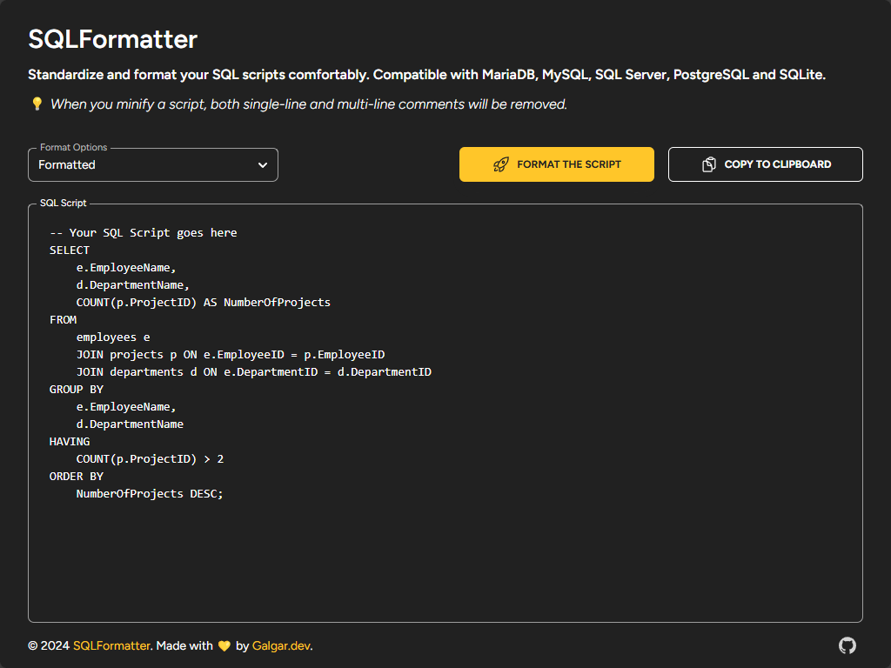

[](https://github.com/galgardev/SQLFormatter/forks)
[](https://github.com/galgardev/SQLFormatter/watchers)
[](https://github.com/galgardev/SQLFormatter/stargazers)
[](https://github.com/galgardev/SQLFormatter/graphs/contributors)

# SQLFormatter

Welcome to `SQLFormatter`, a tool for standardizing and formatting SQL scripts comfortably. This application is compatible with MariaDB, MySQL, SQL Server, PostgreSQL, and SQLite.



[](https://sqlformatter.galgar.dev)
[](https://stackblitz.com/github.com/galgardev/SQLFormatter)

## Table of Contents

- [SQLFormatter](#sqlformatter)
  - [Table of Contents](#table-of-contents)
  - [Project Overview](#project-overview)
  - [Getting Started](#getting-started)
    - [Previous considerations](#previous-considerations)
    - [Usage](#usage)
  - [Tech Stack](#tech-stack)
    - [Key Dependencies](#key-dependencies)
  - [Project Structure](#project-structure)
    - [Key Directories and Files](#key-directories-and-files)
  - [Styling](#styling)
    - [Components](#components)
      - [Header](#header)
      - [Formatter](#formatter)
      - [Footer](#footer)
  - [Hooks](#hooks)
  - [Utilities](#utilities)
  - [Contributing](#contributing)
  - [License](#license)

## Project Overview

`SQLFormatter` is a tool designed to help developers standardize and format their SQL scripts with ease. It supports various SQL dialects and provides options for both minified and formatted output.

## Getting Started

### Previous considerations

As already mentioned in the application, when you minify a script, both single-line and multi-line **comments will be removed**.

### Usage

1. Access the application URL:

   [https://sqlformatter.galgar.dev](https://sqlformatter.galgar.dev)

2. Paste your SQL script in the text area.

3. Select the desired format in the “Format Options” selector.

4. Click on the “Format the Script” button.

5. And volià! It's that simple.

> **Note:** Optionally, you can copy the output to the clipboard by clicking the “Copy to Clipboard” button.

## Tech Stack

- **React**: A JavaScript library for building user interfaces.
- **Vite**: A fast build tool for modern web projects.
- **Tailwind CSS**: A utility-first CSS framework.
- **Material Tailwind**: Tailwind components library inspired by Material Design.

### Key Dependencies

- **sql-formatter**: SQL Formatter is a JavaScript library for pretty-printing SQL queries.
- **@heroicons/react**: Beautiful hand-crafted SVG icons, by the makers of Tailwind CSS.

## Project Structure

```plaintext
sqlformatter/
┣ public/
┃ ┣ assets/
┃ ┃ ┣ fonts/
┃ ┃ ┃ ┗ ...
┃ ┃ ┗ img/
┃ ┃   ┗ ...
┣ src/
┃ ┣ assets/
┃ ┣ components/
┃ ┃ ┣ FooterComponents/
┃ ┃ ┃ ┗ Copyright.jsx
┃ ┃ ┣ FormatterComponents/
┃ ┃ ┃ ┣ AlertMessage.jsx
┃ ┃ ┃ ┣ FormatOptions.jsx
┃ ┃ ┃ ┣ FormatterButtons.jsx
┃ ┃ ┃ ┗ ScriptTextarea.jsx
┃ ┃ ┣ Icons/
┃ ┃ ┃ ┣ AlertIcon.jsx
┃ ┃ ┃ ┣ CopyIcon.jsx
┃ ┃ ┃ ┣ GitHubIcon.jsx
┃ ┃ ┃ ┗ StartIcon.jsx
┃ ┃ ┣ Footer.jsx
┃ ┃ ┣ Formatter.jsx
┃ ┃ ┣ Header.jsx
┃ ┃ ┗ SocialLinks.jsx
┃ ┣ hooks/
┃ ┃ ┣ useCopy.js
┃ ┃ ┗ useFormat.js
┃ ┣ layouts/
┃ ┃ ┗ BaseLayout.jsx
┃ ┣ styles/
┃ ┃ ┣ components/
┃ ┃ ┃ ┣ footer.css
┃ ┃ ┃ ┣ formatter.css
┃ ┃ ┃ ┗ header.css
┃ ┃ ┗ global.css
┃ ┣ utils/
┃ ┃ ┗ MetaTags.jsx
┃ ┣ App.jsx
┃ ┣ consts.js
┃ ┗ main.jsx
┣ index.html
┗ ...
```

### Key Directories and Files

- **public/**: Contains static assets used in the application.
- **src/**: Main source code directory.
  - **components/**: Contains reusable React components.
  - **hooks/**: Custom React hooks for managing state and logic.
  - **layouts/**: Layout components for different sections of the application.
  - **styles/**: CSS files for styling components.
  - **utils/**: Utility functions and components.

## Styling

This project uses Tailwind CSS for styling. Global styles are defined in `src/styles/global.css`, while component-specific styles are located in the `src/styles/components` directory.

### Components

#### Header

The Header component displays the title and description of the application.

#### Formatter

The Formatter component provides options for formatting and minifying SQL scripts.

#### Footer

The Footer component contains copyright information.

## Hooks

- **useCopy**: Custom hook for handling script copying functionality.
- **useFormat**: Custom hook for formatting SQL scripts.

## Utilities

- **MetaTags**: Utility component for setting meta tags dynamically.
- **consts.js**: Contains site-wide constants such as the site title and description.

## Contributing

Contributions to this project are welcome! Feel free to fork the repository and submit a pull request. Please ensure your code follows the established conventions and passes all linting checks.

## License

This project is licensed under the MIT License. See the [LICENSE](LICENSE) file for more details.

---

Happy SQL formatting! 🎉
